# Blockchain

## What Is a Blockchain? 🔗

A **blockchain** is a *distributed, append‑only ledger* maintained by a network of nodes that reach consensus without a central authority.

## 1 Block Anatomy

```mermaid
graph TD
  H[Block Header] -->|Prev Hash| P
  H -->|Merkle Root| M
  H -->|Timestamp| T
  subgraph Transactions
    TX1[(Tx₁)]---TX2[(Tx₂)]---TX3[(Tx₃)]
  end
```

| Field            | Purpose                                       |
|------------------|-----------------------------------------------|
| **Previous Hash**| Links each block to its predecessor           |
| **Merkle Root**  | Single hash summarizing all transactions      |
| **Nonce**        | Random value adjusted to meet difficulty (PoW)|

## 2 Hashing & Immutability

1. Serialize block contents → compute **SHA‑256** hash.  
2. Store that hash in the next block’s header.  
3. Altering any historical block changes its hash, breaking every subsequent link—making tampering *computationally prohibitive*.

## 3 Merkle Trees

- Provide **O(log n)** proofs that a transaction exists in a block.  
- Lightweight clients (SPV) can verify payments without downloading the entire chain.

> **One‑liner:** A blockchain = distributed database + cryptographic hash chain + consensus protocol.
