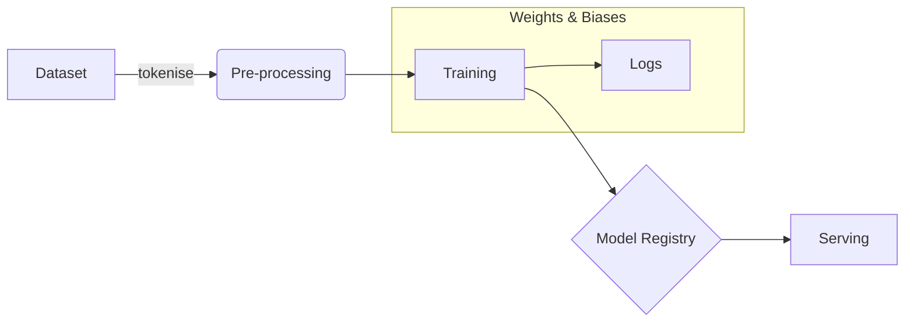

# Fine-Tuning Transformers

Fine-tuning adapts a pre-trained transformer to a downstream task by continuing training on a smaller, task-specific dataset.

## 1 Why Fine-Tune?

1. **Parameter Efficiency** – Re-use base model weights; training converges in a few epochs.
2. **Task Specialisation** – Domain-specific jargon (e.g. legal, medical) improves drastically.
3. **Lower Latency** – Smaller fine-tuned checkpoints can outperform prompting large models.

## 2 Methods

| Method              | Parameters Updated | Typical Data Size |
|---------------------|--------------------|-------------------|
| **Full Fine-Tune**  | All                | 10⁵-10⁶ samples   |
| **LoRA**            | Rank-decomposed adapters | 10³-10⁴ |
| **Prefix Tuning**   | Prompt tokens only | 10²-10³ |
| **QLoRA**           | 4-bit quantised adapters | 10⁴ |

## 3 MLOps Pipeline

Fine-tuning jobs often run on **Kubernetes** GPU nodes (see [K8S Controller](../container/Kubernetes/Controller.md)) and stream logs into **Kafka Topics** for monitoring.

## 4 Relation to Prompt Engineering

Prompt engineering (see [Prompt Engineering](./prompt-engineering.md)) usually precedes fine-tuning: use prompts to explore task feasibility before committing compute budget.
