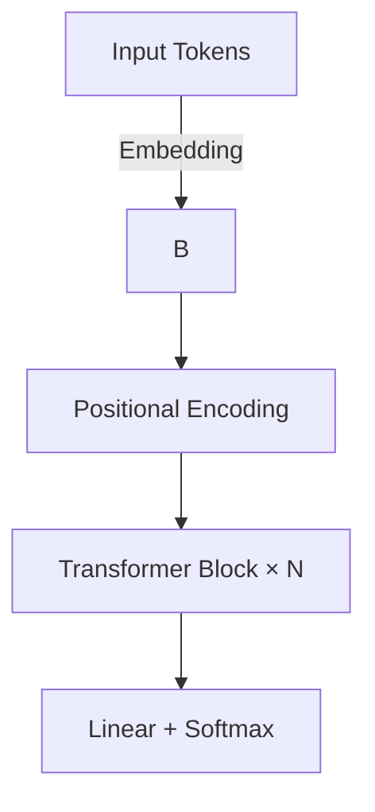
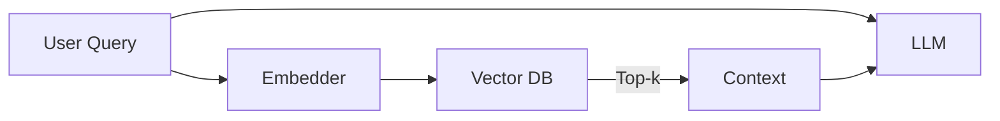

# Large Language Models

These notes consolidate three key areas of modern large‑language models (LLMs):

1. **Architecture & Transformer Basics**  
2. **Training, Fine‑Tuning, and Retrieval‑Augmented Generation (RAG)**  
3. **Inference, Serving, and Optimization**

---

## 1 LLM Architecture & Transformer Basics

### 1.1 Transformer Blueprint



**Self‑Attention**

For head *h*:

\[
\mathrm{Attention}(Q_h,K_h,V_h)=\mathrm{softmax}\!\left(\frac{Q_h K_h^\top}{\sqrt{d_k}}\right)V_h
\]

*RoPE* and *ALiBi* add relative positioning so models extrapolate to longer contexts.

### 1.2 Scaling Laws

\[
\text{loss}(N,D,C) \approx A N^{-\alpha} + B D^{-\beta} + C R^{-\gamma}
\]

> **Takeaway:** Bigger *and* better data lower perplexity predictably—handy for budgeting.

### 1.3 Parameter Landmarks (2023‑2025)

| Model            | Params | Context | Notable Feature |
|------------------|--------|---------|-----------------|
| GPT‑3.5          | 175 B  | 8 k     | Dense           |
| Llama‑3 70 B     | 70 B   | 16 k    | Open weights    |
| Falcon 180 B     | 180 B  | 4 k     | Arabic + code   |
| Mixtral 8×22 B   | 45 B *active* | 32 k | Sparse MoE     |

*MoE = Mixture of Experts → higher capacity with lower inference cost.*

---

## 2 Training, Fine‑Tuning & RAG

### 2.1 Pre‑Training

```
Objective: p(token_t | token_<t)
Loss:      cross‑entropy
Data:      multi‑trillion‑token mix (web, books, code)
Budget:    10³–10⁴ GPU‑days
```

- **Curriculum:** Blend code at ~30 % to boost reasoning.
- **Tokenizer:** BPE/Unigram, 32 k–100 k vocab, avoid `<UNK>`.

### 2.2 Instruction Fine‑Tuning (LoRA example)

```python
from transformers import AutoModelForCausalLM, AutoTokenizer
from peft import LoraConfig, get_peft_model

base = "meta-llama3-8b"
model = AutoModelForCausalLM.from_pretrained(base, device_map="auto")
tokenizer = AutoTokenizer.from_pretrained(base)

peft_cfg = LoraConfig(r=8, lora_alpha=32, target_modules=["q_proj","v_proj"])
model = get_peft_model(model, peft_cfg)
# ...load dataset and train...
```

- Tune < 1 % of weights → fits on a single 24 GB GPU.
- **DPO** / **RLHF** refine style & safety via preference data.

### 2.3 Retrieval‑Augmented Generation (RAG)



1. Embed query & docs.  
2. Retrieve top‑k passages.  
3. Prepend to prompt (chunk 512–1024 tokens, 20 % overlap).

Popular stacks: **LangChain / LlamaIndex** + **Qdrant / Pinecone**.

### 2.4 Evaluation Cheat‑Sheet

| Metric      | Checks…          |
|-------------|------------------|
| **Perplexity** | Language modeling fit |
| **MMLU / GSM8K** | Reasoning & QA |
| **TruthfulQA**   | Hallucination rate |
| **MT‑Bench**     | Chat alignment |

---

## 3 Inference, Serving & Optimization

### 3.1 Single‑GPU Quickstart (vLLM)

```bash
pip install vllm==0.4.2
python -m vllm.entrypoints.api_server   --model meta-llama3-8b   --max-model-len 8192
```

*vLLM* uses PagedAttention → hundreds of concurrent streams on one GPU.

### 3.2 Scaling Strategies

| Strategy            | Best for…               | Tools             |
|---------------------|-------------------------|-------------------|
| Tensor Parallelism  | Very large dense models | Megatron‑LM, DS   |
| Pipeline Parallel   | Long sequences          | DeepSpeed, DS     |
| Sparse MoE Routing  | High throughput         | DeepSpeed‑MoE     |
| KV‑Cache Offload    | >32 k context           | vLLM, SGLang      |

### 3.3 Quantization Snapshot

| Method | Memory Cut | Quality Loss |
|--------|------------|--------------|
| INT8   | 4×         | < 1 %        |
| NF4    | 8×         | ~1.5 %       |
| GPTQ   | 4×         | tunable      |
| AWQ    | 4–6×       | minimal      |

```python
from awq import AutoAWQForCausalLM
model = AutoAWQForCausalLM.from_quantized("mistral-7b-awq", w_bit=4)
```

### 3.4 Production Tips

- **KServe** / **Ray Serve** for K8s autoscaling & canaries.  
- **Prompt caching** saves 20–50 % tokens.  
- Track **Tokens/s**, **P95 latency**, **Failed requests** via Prometheus.

> **Golden Rule:** If you can’t measure it, you can’t scale it.

---

## References

- Vaswani et al., *Attention Is All You Need* (2017)  
- Kaplan et al., *Scaling Laws* (2020)  
- Fedus et al., *Pathways & Sparse MoE* (2022)  
- vLLM docs – <https://vllm.ai/>  
