# Retrieval‑Augmented Generation (RAG)

**RAG** combines vector search with language‑model generation so your application can answer questions using *fresh, domain‑specific knowledge* instead of the model’s static training data.

---

## 1 Why RAG?

| Benefit               | Detail                                                         |
|-----------------------|----------------------------------------------------------------|
| **Up‑to‑date answers**| Inject current docs; bypass the model’s knowledge cut‑off.     |
| **Smaller models**    | Offload facts to the retriever; keep the LLM lightweight.      |
| **Reduced hallucination** | Source grounding text that the model can quote or cite.   |
| **Data governance**   | Easily remove or update knowledge by re‑indexing documents.    |

---

## 2 Pipeline Anatomy

```mermaid
flowchart TD
  U[User Query] --> E[Embedder]
  E --> V[Vector<br/>DB]
  V -->|Top‑k docs| C[Context]
  U --> P[Prompt Builder]
  C --> P
  P --> L[LLM🔮]
  L --> R[Response]
```



1. **Embed** query and compare against a vector index.  
2. **Retrieve** top‑k chunks; optional keyword or filter stage.  
3. **Compose prompt**: system msg + retrieved context + user query.  
4. **Generate** answer with citations.

---

## 3 Retrieval Layer

### 3.1 Embedding Models

| Model        | Dim  | Strength                 |
|--------------|------|--------------------------|
| `text-embedding-3-small` | 1 536 | Cost‑effective, multilingual |
| `bge-large-en` | 1 024 | Open‑source, rerank friendly |
| `instructor-xl`| 768  | Instruction‑tuned for QA |

> **Rule:** Use domain‑trained or instruction embeddings if your queries are question‑like.

### 3.2 Chunking Strategy

```text
Chunk size: 512–1 024 tokens
Overlap   : 10–20 %
Heuristic : split on headings > paragraphs > sentences
```

### 3.3 Vector Databases

| DB       | Index Type      | Notes                        |
|----------|-----------------|------------------------------|
| **Qdrant**   | HNSW + payload | Rust core, dynamic filters  |
| **Pinecone** | ScaNN/HNSW     | Fully‑managed cloud         |
| **Milvus**   | IVF‑Flat, GPU  | Scales to billions of vectors|

---

## 4 Generation Layer

### 4.1 Prompt Template (Jinja style)

```jinja
SYSTEM:
You are an expert assistant. Cite sources like [1], [2].

CONTEXT:

[{{ loop.index }}] {{ doc.content | truncate(300) }}


USER: {{ question }}
ASSISTANT:
```

### 4.2 Python Skeleton (LangChain)

```python
from langchain.embeddings import OpenAIEmbeddings
from langchain.vectorstores import Qdrant
from langchain.chat_models import ChatOpenAI
from langchain.chains import RetrievalQA

emb = OpenAIEmbeddings(model="text-embedding-3-small")
vectordb = Qdrant(collection_name="kb", embeddings=emb)

llm  = ChatOpenAI(model_name="gpt-4o-mini", temperature=0.2)
qa   = RetrievalQA.from_chain_type(
         llm=llm,
         chain_type="stuff",
         retriever=vectordb.as_retriever(search_kwargs={"k": 4})
       )

qa({"query": "How does PID control work?"})
```

---

## 5 Evaluation & Guardrails

| Metric              | Checks…             | Tooling            |
|---------------------|---------------------|--------------------|
| **Groundedness**    | Citation accuracy   | Atlas Eval, RAGAS |
| **Answer F1 / BLEU**| Content relevancy   | LM‑eval‑harness    |
| **Latency & cost**  | Real‑time SLA       | Prometheus + Grafana |
| **Toxicity / PII**  | Safety compliance   | OpenAI Moderation API |

---

## 6 Operational Tips

1. **Hybrid Retrieval** (BM25 + vectors) boosts recall on rare terms.  
2. **Cold‑cache pre‑warm:** pre‑query popular FAQs during deployment.  
3. **Index refresh cadence:** real‑time via Kafka CDC or nightly batch.  
4. **Citation truncation:** store doc titles + hashes to keep prompts short.  
5. **Fallbacks:** if retrieval returns <3 docs → switch to direct LLM answer with disclaimer.

---

## 7 Security Considerations

- **Strip PII** before embedding; vectors are hard to delete.  
- **Tenant isolation:** namespaced collections per customer; sign requests.  
- **Prompt injection defense:** validate and sanitize retrieved text.

---

## 8 RAG Checklist ✅

- [ ] Domain corpus collected & deduplicated  
- [ ] Embeddings evaluated (`cos_sim` vs. `dot_prod`)  
- [ ] Vector DB latency < 100 ms at p95  
- [ ] Prompt template includes citations & role separation  
- [ ] Offline eval > 85 % groundedness, < 1 % toxicity  
- [ ] Dashboards & alerts configured

---

## 9 Further Reading

- Lewis et al., *Retrieval‑Augmented Generation* (2020)  
- LlamaIndex docs – <https://www.llamaindex.ai/>  
- LangChain RAG cookbook – <https://python.langchain.com/docs/use_cases/question_answering/>

*Build once, re‑index often—your model will thank you.* ✨
