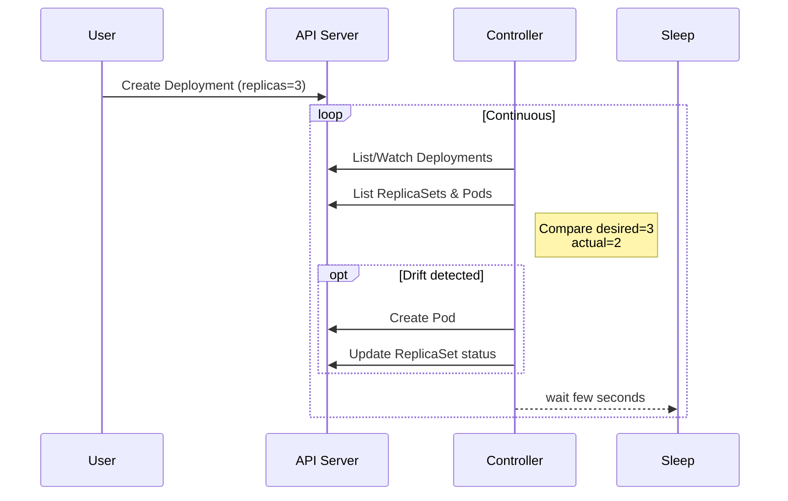

# ontroller?

A **controller** is a control-loop process running in the Kubernetes control plane (or outside, for custom controllers) that:

1. **Watches** the cluster state via the API server.  
2. **Compares** actual state to the desired state declared by users.  
3. **Acts** to reconcile any drift—creating, updating, or deleting resources until the two match.

> “Declare intent; let the controller do the work.”

---

## Built-in Controllers & Their CRDs

| Controller | Custom Resource Kind | Purpose |
|------------|---------------------|---------|
| **DeploymentController** | `Deployment` | Maintains replica sets & rolling updates |
| **ReplicaSetController** | `ReplicaSet` | Ensures a stable set of identical Pods |
| **StatefulSetController** | `StatefulSet` | Ordered, sticky identity Pods + PVCs |
| **DaemonSetController** | `DaemonSet` | Runs one Pod per node (logs, monitoring) |
| **Job / CronJob Controllers** | `Job`, `CronJob` | Batch & scheduled workload management |
| **HorizontalPodAutoscalerController** | `HorizontalPodAutoscaler` | Scales replicas based on metrics |
| **ServiceLBController** | `Service` (type = `LoadBalancer`) | Provisions cloud load balancers |

These run inside `kube-controller-manager` (or cloud-specific managers).

---

## Anatomy of the Reconciliation Loop

